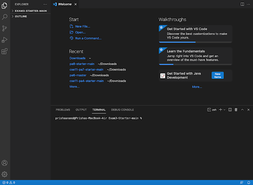
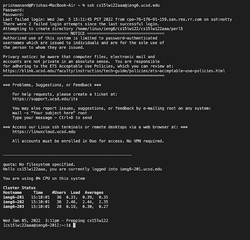
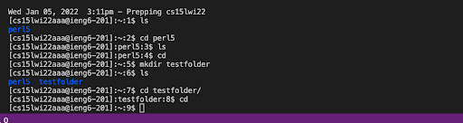
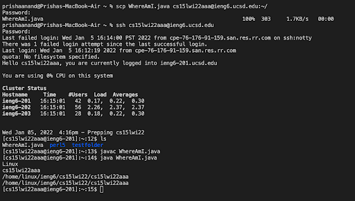
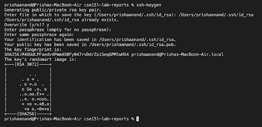
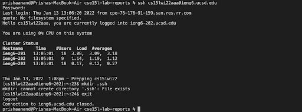
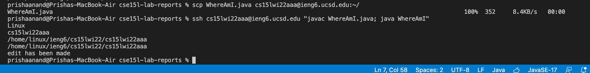

## How to Log into a Remote Server
**Server Used: ieng6**

1. ***Installing VS Code:*** I already had VSCode installed on my computer from a previous class. This is how VSCode should look after installation.

2. ***Remotely Connecting:*** In order to establish a connection to the remote computer, you can run the following ssh command in the VS Code terminal: `$ ssh cs15lwi22zz@ieng6.ucsd.edu`, but using your account id instead of zz (mine was 'aaa'). Then you will be prompted to type in your password, and after doing so, the terminal will display some of your account information. The interaction is displayed in the screenshot below.

3. ***Trying Some Commands:*** In the terminal, you can use certain commands that can be run on both your computer and the remote computer to return useful information.  For example, as shown in the screenshot, I used the commands `ls`, `cd`, and `mkdir`. To log out from the remote server, use Cmd + D or the command `exit`. 

4. ***Moving Files with scp:*** The scp command can be run from the client to help copy a file from your computer onto the remote computer. 
* In order to do this, I first created a file titled `WhereAmI.java` which prints useful information, such as the user's home directory and user name. 
* Then I ran the command `scp WhereAmI.java cs15lwi22aaa@ieng6.ucsd.edu:~/` which required a password again. 
* Next, log into the remote server using the ssh command again and run the `ls` command, which should display the file `WhereAmI.java` in the home directory. Now we are able to run the file using javac and java commands on the remote computer as well. 

5. ***Setting an SSH Key:*** In order to avoid the time-consuming process of having to type in your password multiple times, I had to create a ssh key with `ssh-keygen`. This creates a public key (stored on the server in file **id_rsa.pub**) and a private key (stored on the client in file **id_rsa**), allowing us to replace typing the password with an ssh command. I saved the key under the file `/Users/prishaanand/.ssh/id_rsa`. 

Then copy the public key to the server by logging in through ssh, and then running the command `mkdir .ssh.`

Now it should allow you to log in with the key rather than your password. Below is a screenshot of a successful login using the ssh key. 

6. ***Optimizing Remote Running:*** To make remote running faster, you can use multiple commands in one line, write a command in quotes to run it directly on the remote server, and use the up arrow to rerun commands previously used in the terminal. In my case, I had to find the most plesant way to make a local edit to the `WhereAmI.java` class and copying it and running it in the remote server.
After making an edit to the `WhereAmI.java` class on my own computer, I ran the commaand `scp WhereAmI.java cs15lwi22aaa@ieng6.ucsd.edu:~/` which copies the changes made on my computer to the remote server. Next, in order to run it on the remote server, I used the commands `ssh cs15lwi22aaa@ieng6.ucsd.edu "javac WhereAmI.java; java WhereAmI"`. This printed out the new edit along with all the previous content, as expected.

 In total, this took me around 4 keystrokes (2 for pasting each line of code and 2 for hitting the enter key to run it). This was much faster than before, where I would write each command on a seperate line and also log in to the server first before running the ls command (which took around 12 keystrokes). So, implementing these tactics significantly reduced the amount of keystrokes needed to run differernt commands. Here is what my terminal looked like during this process:

