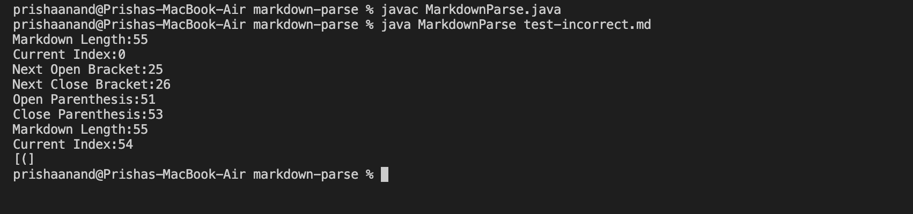
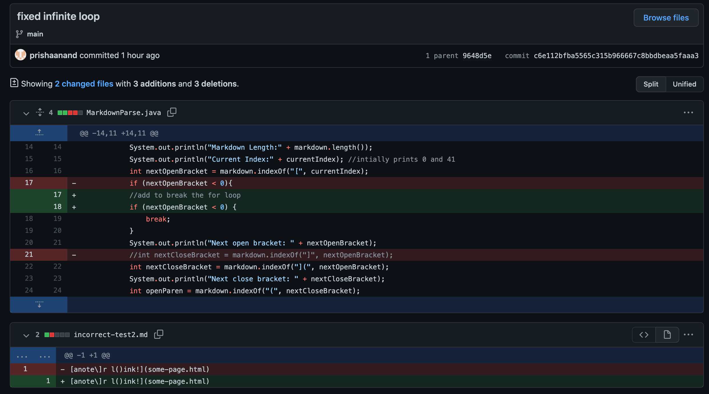

## Debugging Process
**Group Panther: Fixing 3 Bugs in MarkdownParse**

1. ***Bug #1: Lab 3***
The first failure inducing input we were able to come up with for the `MarkdownParse.java` file was [incorrect-test2.md](https://github.com/prishaanand/markdown-parse/blob/main/incorrect-test2.md). This file included a `\]` in the text to be displayed for the link. 
However, this caused our code to have the symptom of displaying `[(]`, as shown in the image below. This was because our current code checked for the next occurence of a closed bracket, regardless of whether it was to included in displayed text portion of the link. 

In order to fix this issue, we edited our `MarkdownParse.java` file to detect the ending closed bracket only when there was an open parenthesis following directly after, which would effectively avoid any brackets placed inside the text. 
The code change difference is shown here: 

2. ***Bug #2: Lab 3***
The second failure inducing input we created was [test-incorrect.md](https://github.com/prishaanand/markdown-parse/blob/main/test-incorrect.md). This file caused the symptom of an infinite loop, since the next open bracket never gets detected, as it is inside of a parenthesis in the form `([])`. The results are shown below. 

To alter the code to account for this issue, we decided to add a break in the loop, which would terminate the loop whenever the index for the next open bracket was not found (when it returns -1). Here are the code change differences:

3. ***Bug #3: Lab 4***
The last failure inducing file occured in the one that was provided as a test case, [test-file8.md](https://github.com/prishaanand/CSE15L-Panther/blob/main/test-file8.md) We expected the test to return an empty string, since no link was provided. However, the test failed since running the file caused the text inside of the (), which in this case was `(a link on the first line)` to be printed. This was the symptom of the failure inducing input, as displayed in the image below. 

We observed that the reason the text inside of the () did not count as a link was simply because there were spaces between the words. So, in order to remedy the bug, we decided to edit the code to check for spaces in the link, and if there was, to not return the contents as a link. This was accomplished by the following code changes in the tester and the orignial file: 

