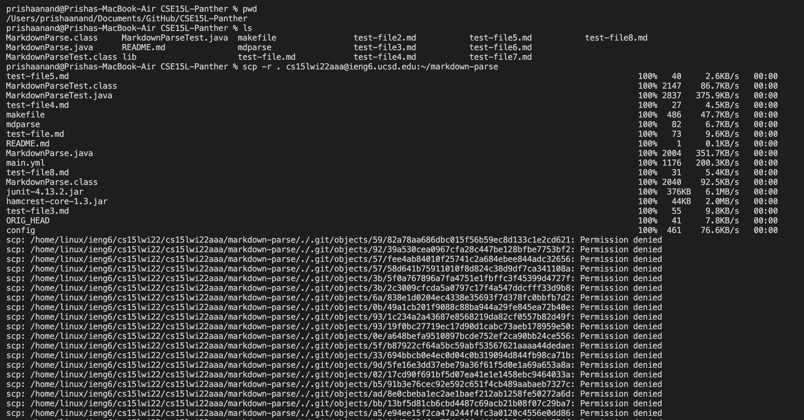
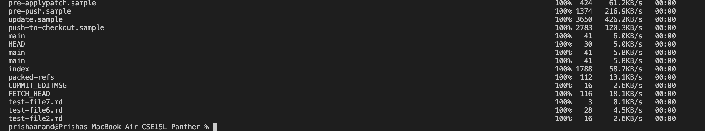
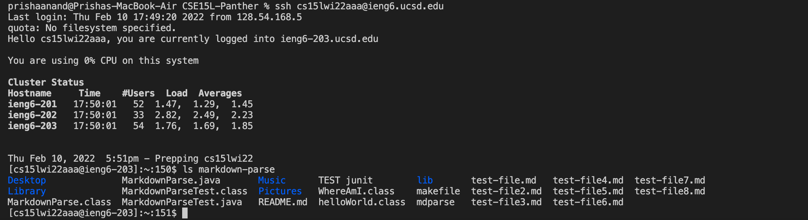
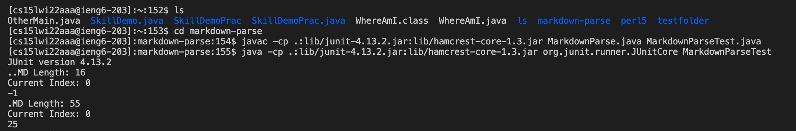
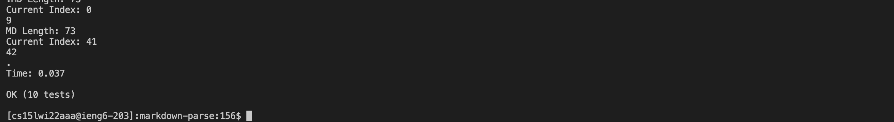
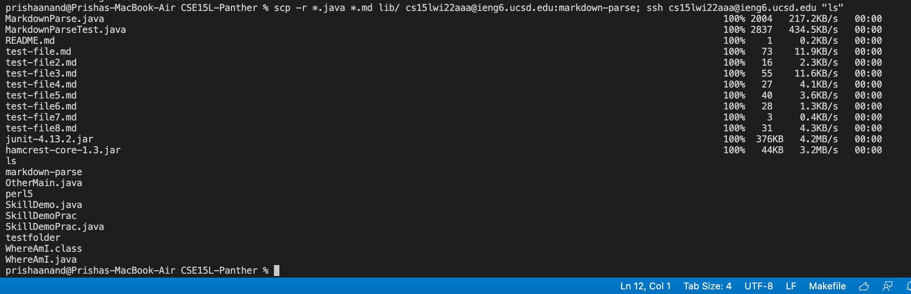

## Copying Entire Directories
**Group Panther: Choice 3** 

1. ***Copy Markdown Parse Directory into ieng6 Account***   
We can copy entire directories from our own personal workspace onto the remote server ieng6 using scp commands. Specifically, we can use the `scp -r` command, which copies all the current files from the MarkdownParse directory, followed by a command to log into the ieng6 server. Lastly, we also need to specify the name of the file where the files from MarkdownParse should be copied to on the remote server. The command to accomplish all of this is as follows: `scp -r . cs15lwi22aaa@ieng6.ucsd.edu:~/markdown-parse` 
Here is the command running in the terminal. 

2. ***Run Tests on ieng6 Server***  
After copying the files, log into your ieng6 account using the ssh command. Here is an example below: 

Then, cd into the markdown-parse file, which is where all the files where copied into. Using the command `cd markdown-parse`. Now we can run the respective javac and java commands to comiple and run the tests outlined in MarkdownParseTest.java. The process is shown in the image below: 

The tests pass, as seen below: 

3. ***One Line Process***
Similar to the task in the first lab report, we can make the process faster by executing these commands using only one line. This can be done by combining 'scp' , ';', and 'ssh'. The specific process in exemplified below, where files are copied, server is logged into, and a basic command of 'ls' is run to show that the files are now in the directory for the remote server.

