## Analyzing MarkdownParse 
**Group Panther** 

Link to my own repo: https://github.com/prishaanand/markdown-parse.git

Link to reviewed repo: https://github.com/ShashankVenkatramani/markdown-parse.git 

### Snippet 1
The code provided in Snippet 1 should produce output similar to that shown in the image below. 
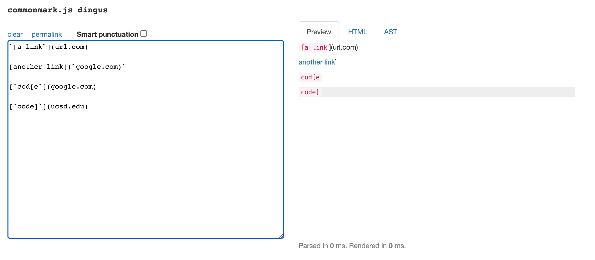
I turned this into a test in the following manner: 
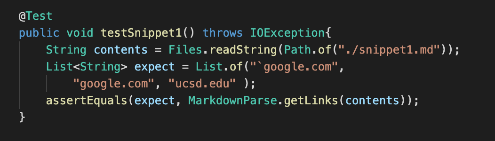
1. My Implementation: --> In my implementation of `MarkdownParse.java`, running the test for the first snippet of code passed, as shown in the terminal output below. 
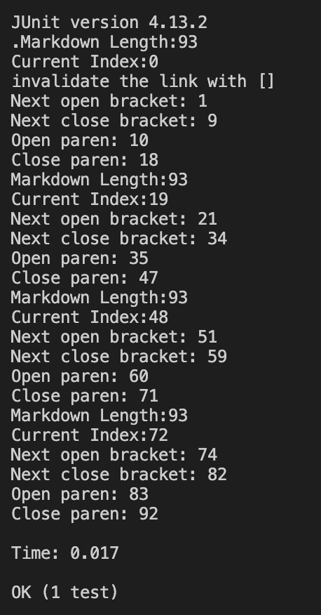
2. Peer's Implemention --> In the peer's implementation that we reviewed, running the first snippet of code did not pass, as shown in the terminal output below. 
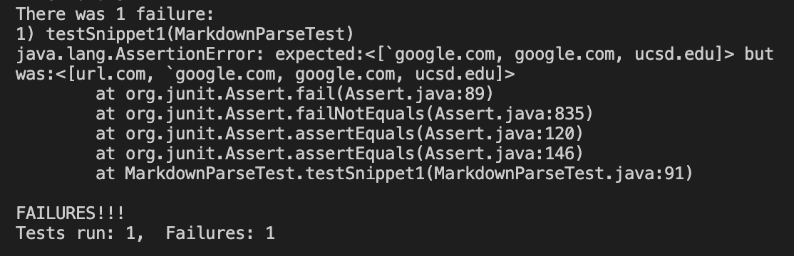

### Snippet 2
The code provided in Snippet 2 should produce output similar to that shown in the image below. 
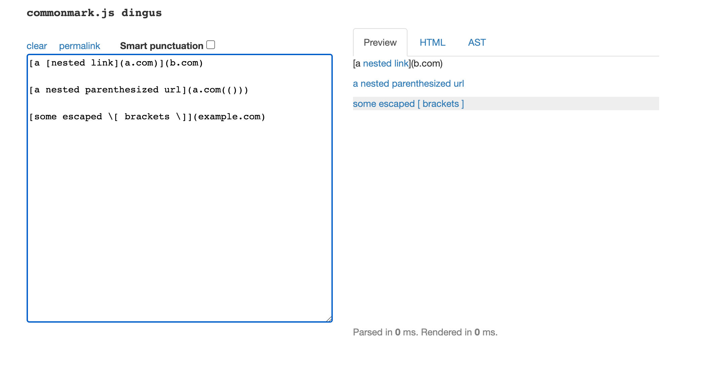
I turned this into a test in the following manner: 
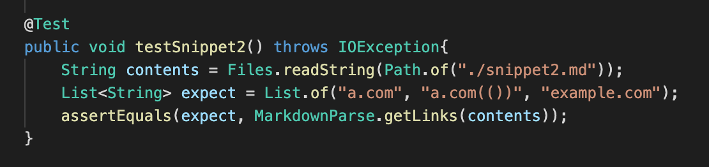
1. My Implementation --> In my implemention, running the test on the second snippet of code passed for 2 out of the 3 lines in the file. The specific test failure is shown below: 
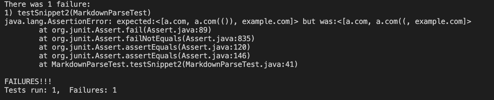
2. Peer's Implementation --> In the peer's implementation that we reviewed, running the first snippet of code did not pass, as shown in the terminal output below. 
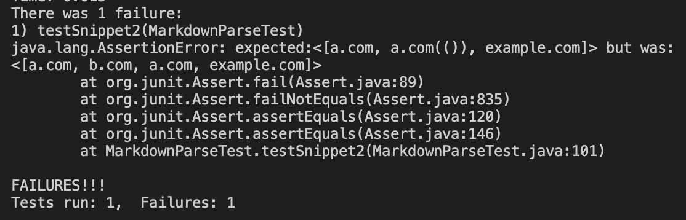

### Snippet 3
The code provided in Snippet 3 should produce output similar to that shown in the image below. 
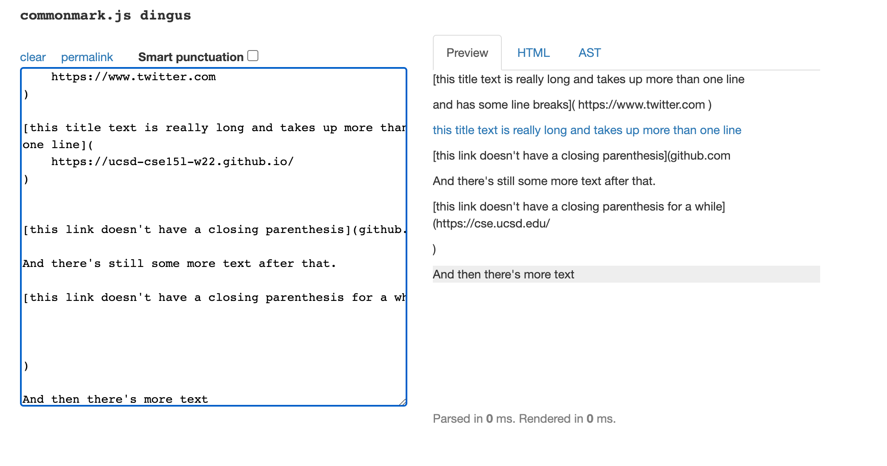
I turned this into a test in the following manner: 
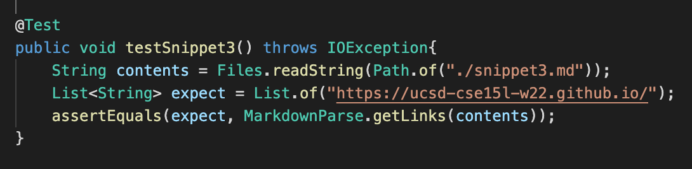
1. My Implementation --> In my implementation, running the test on the third snippet of code passed for only the last line, and failed for all other lines in the file. The specifc test failure is shown below: 
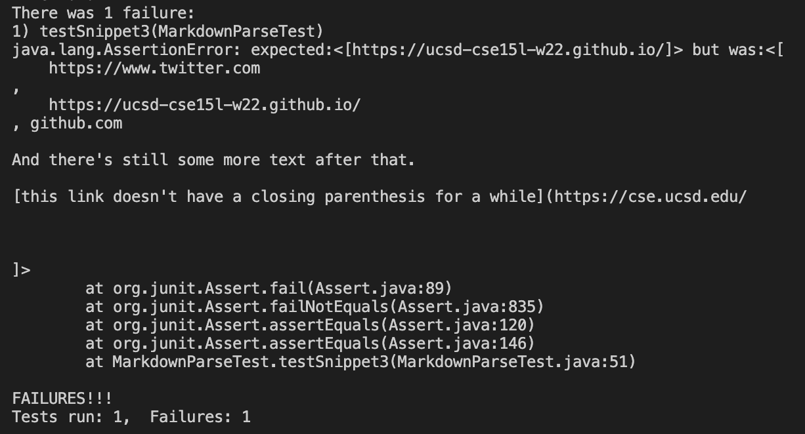
2. Peer's Implementation --> In the peer's implementation that we reviewed, running the first snippet of code did not pass, as shown in the terminal output below.
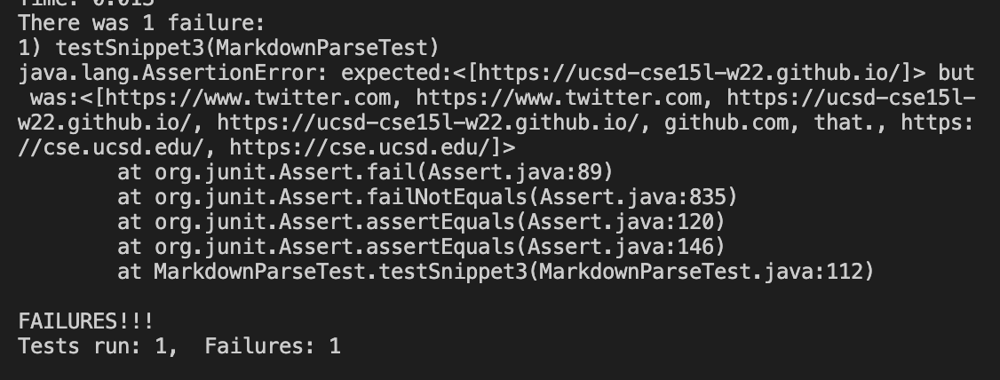

### Questions: Proposed Changes
1. For the issue identified with the backticks, I believe that there is a code change that can resolve the issue. This is an issue that we considered in my implementation of the file, so we created new integers that held the reference to the first occurence of a backtick and a open bracket `[` and a second variable for the closing backtick. If both of these existed in the file, then we set a boolean variable called disregard to true. Lastly, we updated the code that adds the link to return to the `toReturn` variable to only do so if disregard was false (meaning the text did not have backticks so it can be considered as part of the text to display).
However, I think this solution might run into an issue if the first bactick is not immediately followed by an opening bracket. 

2. I don't think there would be a small change that can be made to fix this issue. This is because we need to find a way to count the pairs of parenthesis, and only print the ones inside of a larger set of parenthesis. This is hard since there are multiple parenthesis on all lines of the file, so we would have to find a way to distinguish between the lines. Then we would need to figure out how to only print the nested parenthesis rather than the parenthesis holding the link, which would need much more steps and critical thinking. 

3. For the issue identified with multiple breaks within the text for a link, I think we would need to use the replaceAll() function in order to disregard all the newlines in the file. In this manner, we can treat all the contents in the file as one whole set of text characters, rather than basing it off of text being contained in the same line. 

