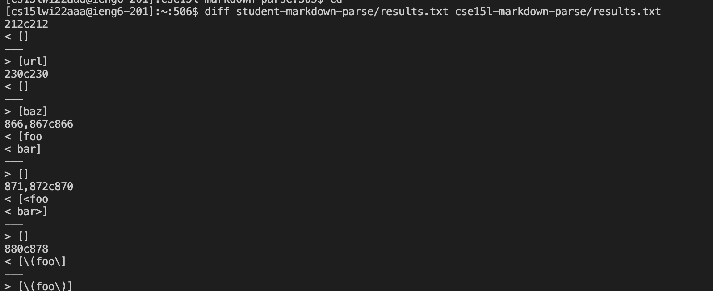
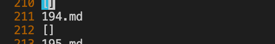
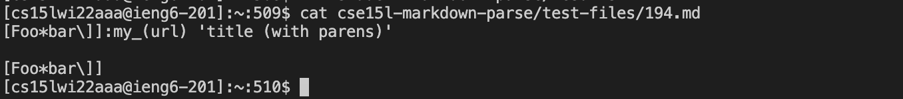
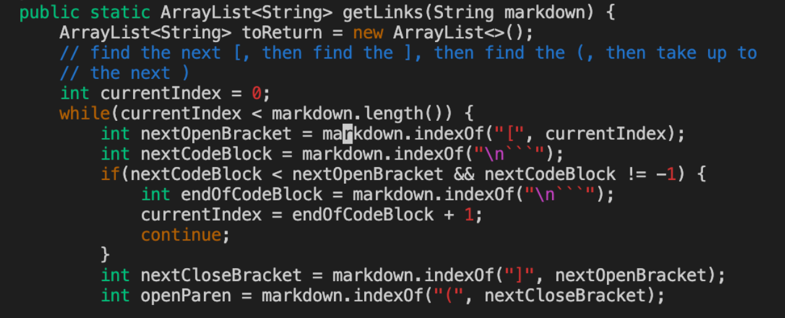
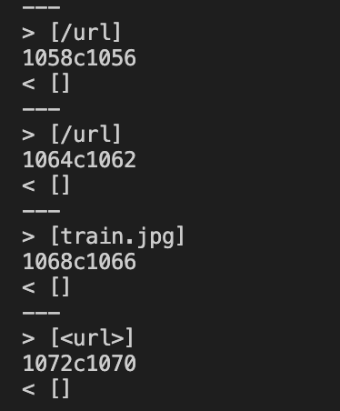
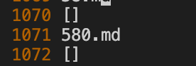
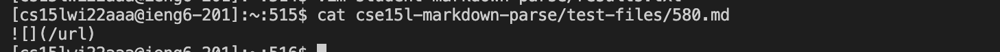
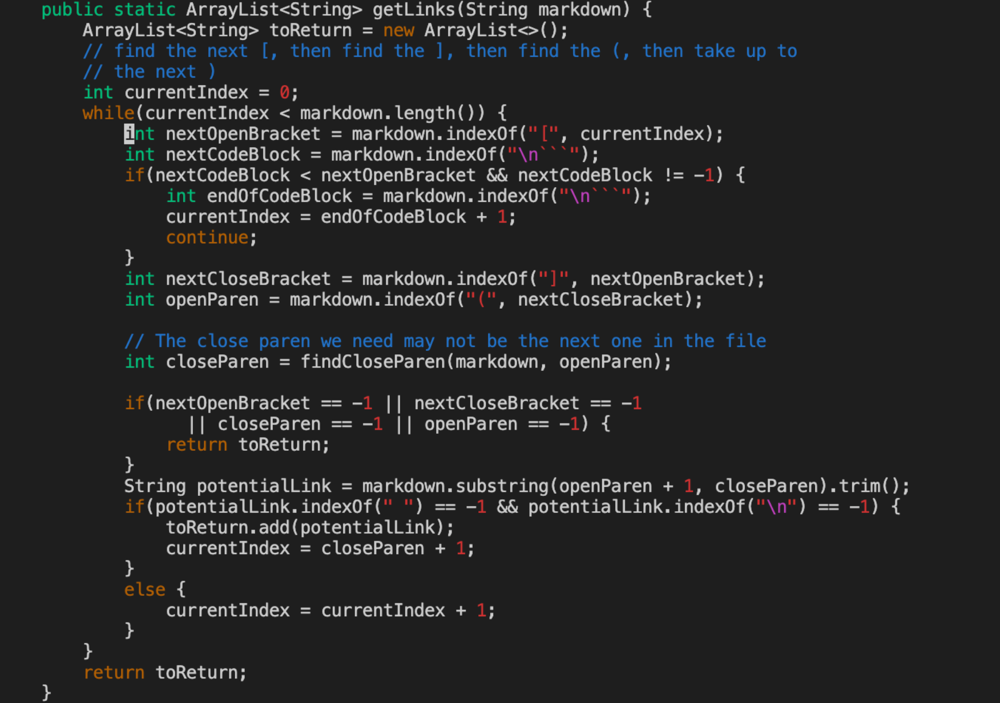

## MarkdownParse Differences
**Group Panther** 

In order to find the differences between running the provided tests from commonmark-spec on the in-class markdown parse repository and my own student implementation fo the markdown parse repository, I ran `script.sh` on both repos and stored the output in a file named `results.txt` using the command `bash script.sh > results.txt`. 

My implementation was stored under the repo `student-markdown-parse` and the class implementation was stored under the repo `cse15l-markdown-parse`. 

## Comparing Outputs
To see the difference between both results, I used the command  `diff student-markdown-parse/results.txt cse15l-markdown-parse/results.txt`. It produced the following output. 

### Difference #1 
1. Seeing the output above, we can say that the first discrepancy in outputs occurs on line 212. So, I used the command `vim student-markdown-parse/results.txt` to see the file that contained the test run on line 212. It produced the following: 

2. So we can tell the test that had different outputs in both implementations was the file 194.md. To see what was in this file, I used the command `cat cse15l-markdown-parse/test-files/194.md`, which displayed the following. 

### Analysis & Solution #1

1.  The output in my implementation was `[]` while the in class implementation had an output of `[url]`. Since the test file had no valid links, my implementation displays the correct output. 

2. When looking at the code in the class implementation, we can see that it fails to consider the case where there is text that comes between the occurence of a close bracket and an open paranthesis. In my implementation, I made it so that it was only counted as valid if the open paranthesis immediately followed the closed bracket, like such `](`. 

3. Here is the part of the class implementation that needs to be addressing to fix the issue. Specifically, on line 64 and 65, the code needs to be altered to account for an open paranthesis occuring immediately after the closed bracket. 

### Difference #2 

1. Refering back to the differences listed in the terminal, we can see that another discrepency occurs on line 1072. 

2. Again, we can use the same command `vim student-markdown-parse/results.txt` to see the file that contained the test run on line 1072. It produced the following: 

3. So, the test in question is test 580.md. To see what was in this file, I used the command `cat cse15l-markdown-parse/test-files/580.md`, which displayed the following. 

### Anaylsis & Solution #2 

1. The output in my implementation was `[]` while the class implementation produced `[/url]`. Since the test file had no valid links (the backslash in front of the url invalidates it being a link), my implementation displayed the correct output.

2. Again, examining the class code we can see that it fails to consider the case of `/`. When a link is preceeded by a backslash, it should not be considered a link. In my implementation, I made sure to only count the link if backslashes were not present. 

3. This portion of the in class implementation can be altered to fix the issue. Specifically, lines 70 and 71 can be updated to check if a backslash exists within the text between the valid open and closed paranthesis. In this case, the method will just return an empty list, which is what we want as there are no links. 

